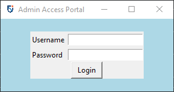
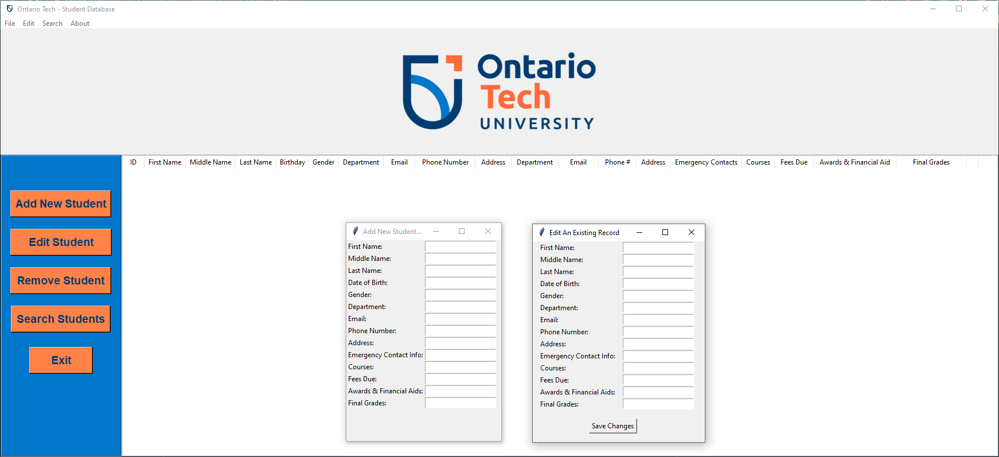

# Python Student Management & Administration System
### A desktop student management system operable through a GUI or command line.

Administrators can easily manage students and associated information. Features include the ability to add new students and student data to the database, modify and delete existing records, and display database details in a table, as well as query the db to search for students or other datapoints.

Correct credentials (admin/password) must first be entered into a login screen in order to start the main program.
---
### Login Prompt

  

---
### Main Window and Add/Edit Prompts

  

<!--- Comment: --->

